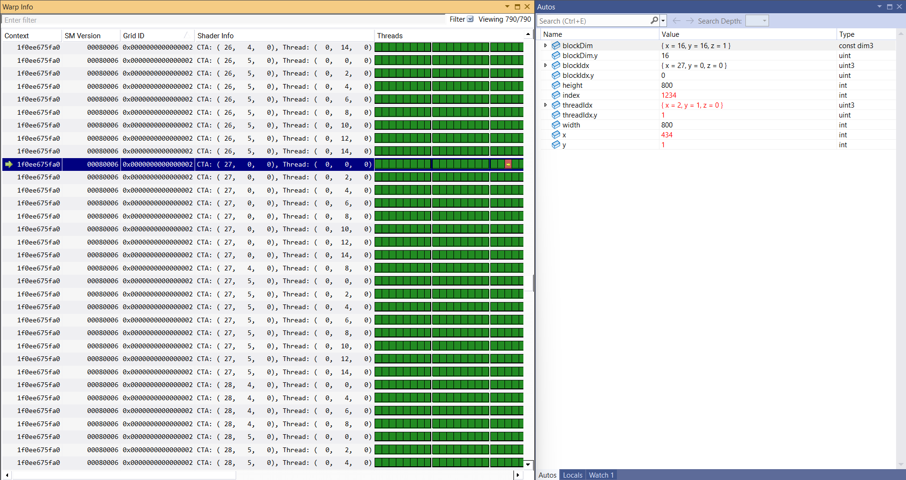

Project 0 Getting Started
====================

**University of Pennsylvania, CIS 5650: GPU Programming and Architecture, Project 0**

* Maaz Saeed
  * [LinkedIn](https://www.linkedin.com/in/maaz-saeed1/)
* Tested on: Windows 11, 11th Gen Intel(R) Core(TM) i7-11800H @ 2.30GHz (2.30 GHz), RTX 3050 Ti (Personal laptop)

### (README)

